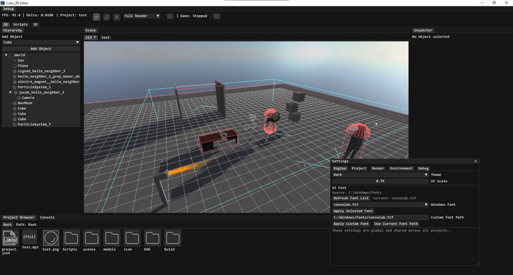

My own 3D Game Engine

Written in C++ using OpenGL (Vulkan rewrite coming soon).

Already features a custom rendering system, Jolt Physics integration, SoLoud audio engine, and Lua scripting support.

Designed for ease of use, a clean interface, and extensive scripting capabilities.

Use Issues for bugs and suggestions.

